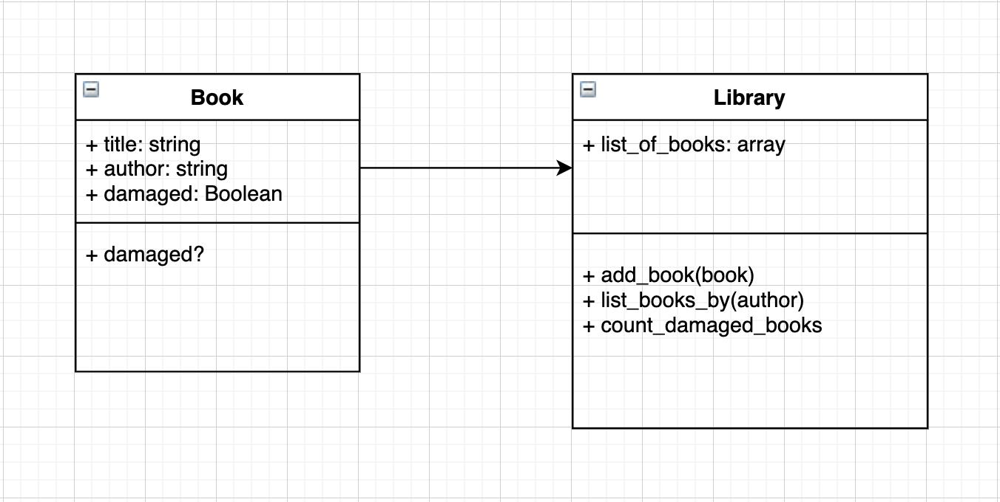

### Domain modelling exercise - Library

#### Task
- Have a go at writing the code and manually testing the library/book example
- Have a go at writing tests in RSpec. If you want to focus on TDD, you can delete the code and test drive the program
- Have a go at isolating your tests between book and library

What would a domain diagram for these user stories look like?

```
As a librarian
So that the public can read my books
I would like a book to have a title and an author

As a librarian
So that the public has more variety
I would like to add a book to the library

As a librarian
So that the public knows all the books in the library
I would like to list all books in the library

As a librarian
So that I can know if a book needs to be replaced
I would like to be able to mark a book as damaged

As a librarian
So that I know how many books need to be replaced
I would like to count how many books are damaged in the library

As a librarian
So that the public know what books titles are written by their favorite author
I would like the library to list all book titles by specific author
```

#### Domain model


